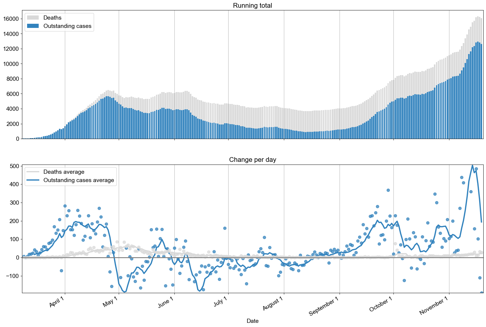
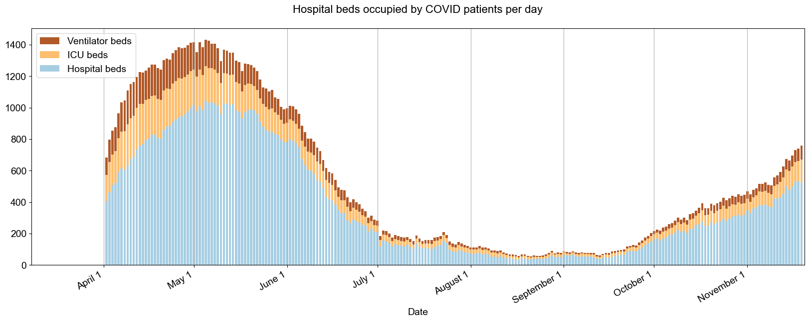
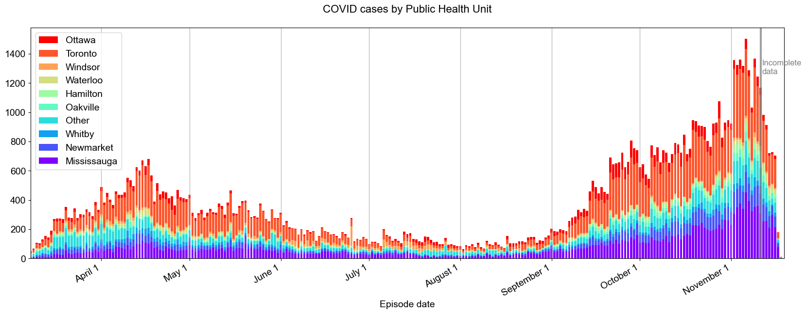
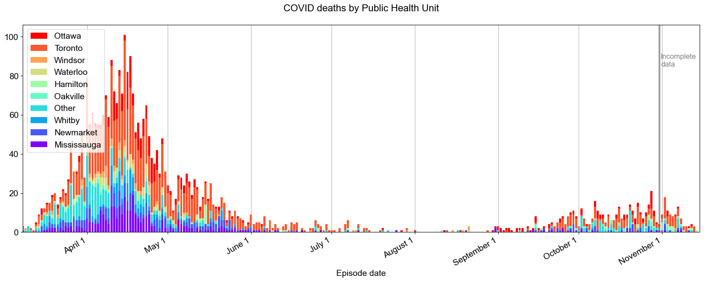
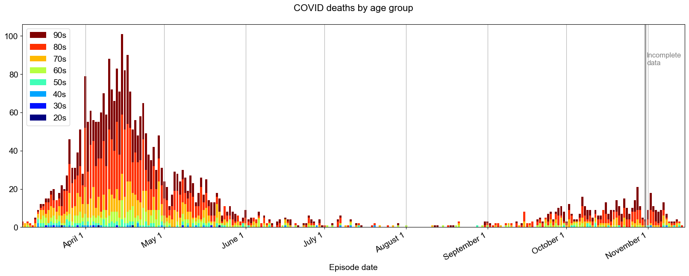
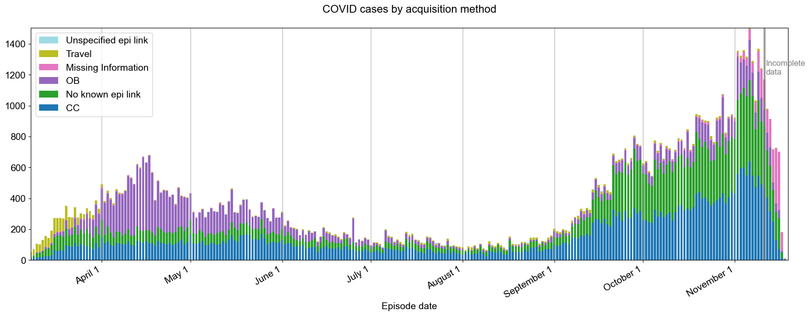

Follow the rise and fall of COVID-19 in Ontario.

For a more detailed analysis, see the [#HowsMyFlattening](https://howsmyflattening.ca) project.

## Overview
 

## Hospital load
 

## Testing volume
 

## Confirmed positive cases
 

## Deaths
 

## Cases by city
 

## Deaths by city
 

## Cases by age group
 

## Deaths by age group
 

## Cases by acquisition method
 

## Mortality by age group 
 

### About 
This data comes from the Ontario Government's [Data Catalog](https://data.ontario.ca/dataset?keywords_en=COVID-19).

This page is maintained by [Rob Welch](mailto:rlwelch@gmail.com). The code to generate the plots is available on [GitHub](https://github.com/rlwelch/covid-ontario).
