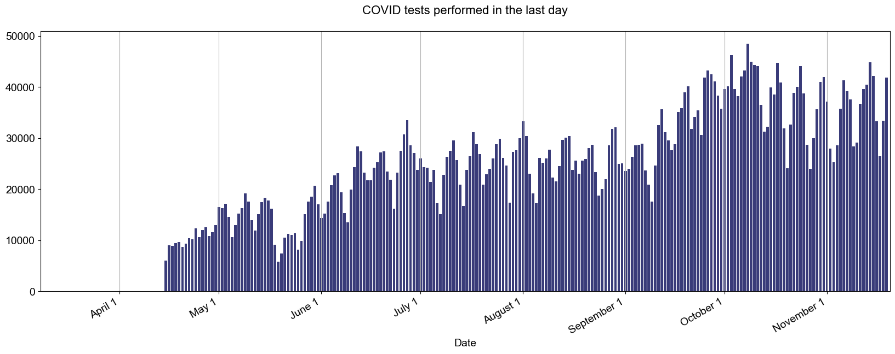
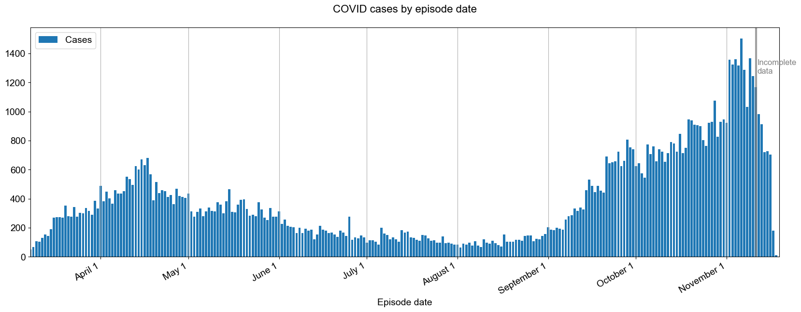
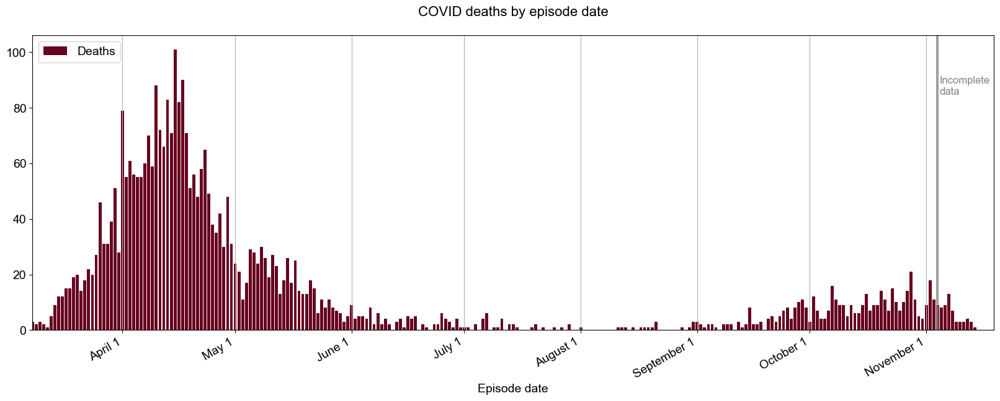
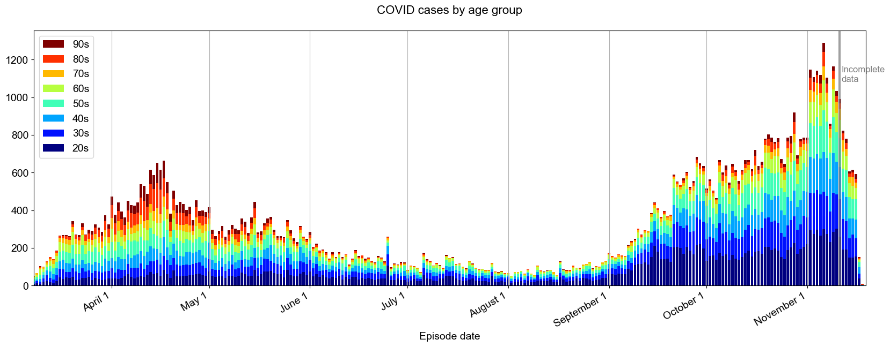
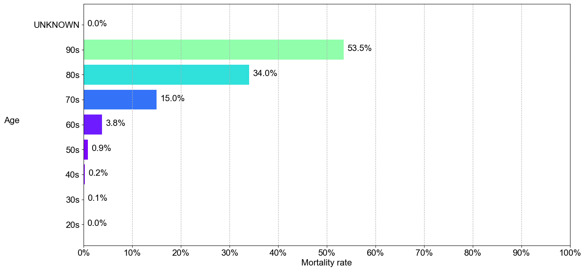

Follow the rise and fall of COVID-19 in Ontario.

This is an independent project to visualize the [Ontario Data Catalog's COVID-19 data](https://data.ontario.ca/dataset?keywords_en=COVID-19).

Please do your part to [stop the spread](https://covid-19.ontario.ca/index.html).

## Overview
 

## Hospital beds 
 

## Testing volume
 

## Confirmed COVID cases 
_Episode date_ is the estimated date of disease onset. 
 

## Deaths
 

## Cases by age group
 

## Deaths by age group
 

## Cases by acquisition method
 

## Mortality rate by age group 
 

### About 
This page is maintained by [Rob Welch](mailto:rlwelch@gmail.com). The code is available on [GitHub](https://github.com/rlwelch/covid-ontario).
